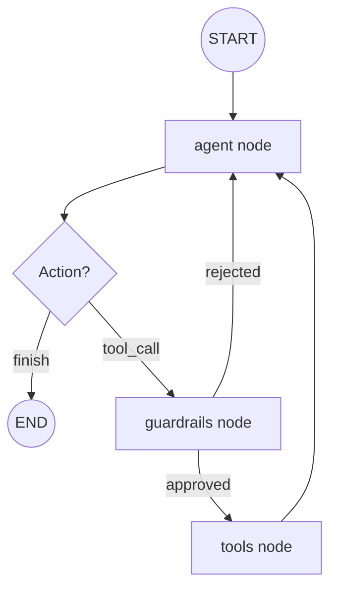

# Simple AI Agent Sandbox

A CLI-based AI agent where **every session runs inside its own ephemeral Ubuntu Docker container**. The agent uses [LangGraph](https://github.com/langchain-ai/langgraph) for the agentic ReAct loop and connects to [LM Studio](https://lmstudio.ai/) as the local LLM backend.

> **Package manager:** [`uv`](https://docs.astral.sh/uv/) — fast Python package and project manager.

---

## Architecture

The agent follows a ReAct pattern enhanced with interactive guardrails and persistent short-term memory.

### System Overview
```
┌───────────────────────────────────────────────────────┐
│                   Host Machine                        │
│                                                       │
│  ┌──────────────┐   docker run   ┌───────────────┐    │
│  │  cli.py      │ ─────────────► │ ubuntu:latest │    │
│  │  (REPL)      │                │ (per session) │    │
│  │              │ ◄─ stdout/err ─└───────────────┘    │
│  └──────┬───────┘                                     │
│         │                                             │
│         ▼                                             │
│  ┌──────────────┐                                     │
│  │  LangGraph   │  agent → guardrails → tools loop    │
│  │  ReAct Graph │  (with MemorySaver)                 │
│  └──────┬───────┘                                     │
│         │                                             │
│         ▼                                             │
│  ┌──────────────┐                                     │
│  │  LM Studio   │  OpenAI-compatible local API        │
│  │  (localhost) │  http://localhost:1234/v1           │
│  └──────────────┘                                     │
└───────────────────────────────────────────────────────┘
```

### Agent Flow (LangGraph)
The following diagram shows how the agent processes user input and handles tool calls through guardrails:



---

## Key Features

- **Ephemeral Sandboxing**: Every session runs in a fresh Docker container.
- **Guardrail System**: Interactive confirmation for sensitive operations (e.g., file deletion).
- **Short-term Memory**: Conversational context is maintained within a session using LangGraph's `MemorySaver`.
- **Token Tracking**: Real-time display of LLM token usage (input/output).
- **Extensible Skills**: Easy to add new capabilities via a modular skill system.

---

## Project Structure

```
simple-ai-agent-sandbox/
├── main.py                    # Entry point
├── pyproject.toml
├── .env.example               # Config template
│
├── skills/
│   └── bash/
│       └── skill.md           # Bash command reference (agent reads this)
│
└── agent/
    ├── cli.py                 # REPL + wiring
    ├── config.py              # Pydantic Settings
    ├── utils.py               # Path & resource utilities
    │
    ├── container/
    │   └── manager.py         # DockerContainerManager
    │
    ├── guardrails/
    │   ├── base.py            # Guardrail ABC + Registry
    │   └── deletion.py        # FileDeletionGuardrail
    │
    ├── skills/
    │   ├── base.py            # Skill ABC + SkillRegistry
    │   └── bash_skill.py      # BashSkill (runs bash in container)
    │
    └── graph/
        ├── state.py           # AgentState
        ├── nodes.py           # Node implementations (agent, guardrails)
        └── graph.py           # build_graph() factory
```

---

## Prerequisites

| Requirement | Notes |
|---|---|
| Python 3.12+ | |
| uv | `curl -Lsf https://astral.sh/uv/install.sh` |
| Docker | Must be running; user must have Docker socket access |
| LM Studio | Running with a model loaded and the local server **enabled** |

---

## Setup

### 1. Clone and enter the repo

```bash
git clone <repo-url>
cd simple-ai-agent-sandbox
```

### 2. Install dependencies

```bash
uv sync
```

### 3. Configure environment

```bash
cp .env.example .env
```

Edit `.env` and set `LLM_MODEL` to the exact model identifier shown in LM Studio.

### 4. Start LM Studio

- Open LM Studio → load a model → click **"Start Server"**

### 5. Run the agent

```bash
uv run agent
```

---

## Adding a New Skill

1. Create `skills/<your-skill>/skill.md` documenting what the skill can do.
2. Create `agent/skills/<your_skill>.py` implementing the `Skill` ABC.
3. Register it in `agent/cli.py` via `registry.register(MySkill())`.

## Adding a New Guardrail

1. Create `agent/guardrails/<your_guardrail>.py` implementing the `Guardrail` ABC.
2. Implement the `check(tool_call)` method to return a confirmation prompt if triggered.
3. Register it in `agent/cli.py` via `guardrail_registry.register(MyGuardrail())`.
